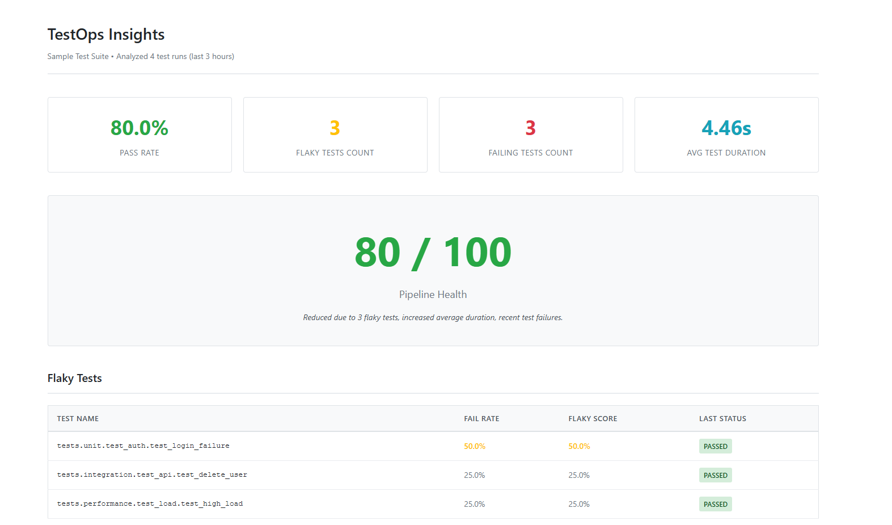

# TestOps Insights

TestOps Dashboard is a tool that analyzes test results generated in CI/CD environments (initially JUnit XML / pytest outputs) to identify flaky tests and assess overall pipeline health.

<p align="center">
  
</p>

## Positioning: TestOps Insights vs Allure

**Allure** is designed for single-run, detailed debugging:

- Rich HTML reports with screenshots, logs, and step-by-step execution details
- Best for investigating why a specific test failed in a single execution
- Focuses on test execution details and debugging information

**TestOps Insights** analyzes multiple test runs for reliability and trends:

- Identifies flaky tests that pass and fail inconsistently across runs
- Calculates pipeline health scores based on historical data
- Tracks trends in pass rates and test durations over time
- Focuses on test system reliability and pipeline health assessment

These tools are complementary: Use Allure for debugging individual test failures, and TestOps Insights for understanding test reliability and pipeline trends.

## Features

- Parse JUnit XML test results from multiple test runs
- Automatic discovery of test runs from folder structure
- Detect flaky tests (tests that fluctuate between pass and fail across runs)
- Identify the most frequently failing tests
- Identify the slowest tests
- Calculate pipeline health score
- Generate static HTML dashboard with metrics
- Configuration file support (testops.yaml)
- CI/CD friendly with exit codes for quality gates
- Machine-readable metrics output (JSON)

## Installation

```bash
pip install -r requirements.txt
```

Or install in development mode:

```bash
pip install -e .
```

After installation, the `testops-insights` command will be available.

## Quick Start

1. **Organize your test results** in a folder structure:

```
test-results/
  run_001/
    junit.xml
  run_002/
    junit.xml
  run_003/
    junit.xml
```

2. **Run the analysis**:

```bash
testops-insights analyze --runs-path ./test-results --out ./report
```

3. **View the dashboard**:

Open `report/index.html` in your browser.

<p align="center">
  
</p>

## Usage

### Basic Command

```bash
testops-insights analyze --runs-path <runs_directory> --out <output_directory>
```

### Command Options

- `--runs-path`: Path to directory containing test run folders (default: `./test-results`)
- `--out`: Output directory for report (default: `./report`)
- `--name`: Test suite name (default: "Test Suite")
- `--config`: Path to config file (default: `testops.yaml` or `testops.yml`)
- `--last N`: Analyze only the most recent N runs
- `--fail-under-health SCORE`: Exit with non-zero code if health score is below threshold

### Configuration File

Create a `testops.yaml` file in your project root:

```yaml
runs_path: ./test-results
analysis:
  flaky_threshold: 0.3
  slow_test_threshold_sec: 2.0
  last_n_runs: 20
report:
  output_dir: ./report
  suite_name: Production Tests
```

Then simply run:

```bash
testops-insights analyze
```

The tool will automatically use the configuration file.

### Examples

**Using sample data:**

```bash
testops-insights analyze --runs-path ./sample-data/runs --out ./report
```

**With configuration file:**

```bash
# Create testops.yaml first, then:
testops-insights analyze
```

**Analyze only last 5 runs:**

```bash
testops-insights analyze --runs-path ./test-results --last 5
```

**Fail build if health score below 70:**

```bash
testops-insights analyze --runs-path ./test-results --fail-under-health 70
```

**Custom suite name:**

```bash
testops-insights analyze --runs-path ./test-results --out ./report --name "CI Pipeline"
```

## CI/CD Integration

### GitHub Actions

```yaml
name: Test Analysis

on:
  push:
    branches: [main]
  pull_request:

jobs:
  analyze:
    runs-on: ubuntu-latest
    steps:
      - uses: actions/checkout@v3

      - name: Set up Python
        uses: actions/setup-python@v4
        with:
          python-version: "3.8"

      - name: Install dependencies
        run: |
          pip install -r requirements.txt
          pip install -e .

      - name: Run tests and collect results
        run: |
          pytest --junitxml=test-results/run_$(date +%s)/junit.xml

      - name: Analyze test results
        run: |
          testops-insights analyze --runs-path ./test-results --out ./report

      - name: Upload report
        uses: actions/upload-artifact@v3
        with:
          name: testops-report
          path: report/

      - name: Check health score
        run: |
          testops-insights analyze --runs-path ./test-results --fail-under-health 70
```

### Jenkins

```groovy
pipeline {
    agent any

    stages {
        stage('Test') {
            steps {
                sh 'pytest --junitxml=test-results/run_${BUILD_NUMBER}/junit.xml'
            }
        }

        stage('Analyze') {
            steps {
                sh '''
                    pip install -r requirements.txt
                    pip install -e .
                    testops-insights analyze --runs-path ./test-results --out ./report
                '''
            }
        }

        stage('Archive') {
            steps {
                archiveArtifacts artifacts: 'report/**', fingerprint: true
                publishHTML([
                    reportDir: 'report',
                    reportFiles: 'index.html',
                    reportName: 'TestOps Dashboard'
                ])
            }
        }

        stage('Quality Gate') {
            steps {
                sh 'testops-insights analyze --runs-path ./test-results --fail-under-health 70'
            }
        }
    }
}
```

## Output Structure

The tool generates a report directory with the following structure:

```
report/
  index.html          # Main dashboard
  metrics.json        # Machine-readable metrics
  assets/             # CSS and other assets (if needed)
```

## Project Structure

```
testops_insight/
  ingestion/        # JUnit XML parsing
  domain/           # Domain models (TestCase, TestRun, TestSuite)
  analytics/        # Analysis functions (flaky detection, health score)
  reporting/        # HTML report generation
  cli/              # Command-line interface
tests/              # Unit tests
sample-data/        # Sample test run data
```

## Dashboard Overview

The dashboard provides:

1. **Executive Summary**: Key metrics at a glance (Pass Rate, Flaky Tests Count, Failing Tests Count, Avg Test Duration)
2. **Pipeline Health Score**: Overall health score (0-100) with explanation
3. **Flaky Tests**: Tests that fluctuate between pass and fail
4. **Top Failing Tests**: Tests that fail consistently
5. **Slowest Tests**: Performance analysis
6. **Trends**: Pass rate and duration trends over time

### Executive Summary and Health Score

<p align="center">
  
</p>

The dashboard shows key metrics in an easy-to-understand format, allowing teams to quickly assess pipeline health at a glance.

### Detailed Test Analysis

<p align="center">
  
</p>

Detailed tables help identify problematic tests and performance bottlenecks, enabling teams to prioritize fixes.

## Running Tests

```bash
pytest tests/
```

Or with verbose output:

```bash
python -m pytest tests/ -v
```

## Architectural Approach

- **Ingestion layer**: Parsing only (JUnit XML → normalized data)
- **Domain layer**: Pure models (TestCase, TestRun)
- **Analytics layer**: Flaky detection, trends, slow tests, health score (pure functions, no side effects)
- **Reporting layer**: Static HTML report generation
- **CLI layer**: Command-line execution suitable for CI environments

Modules are independent and analytics logic is implemented using pure functions (no side effects).

## Requirements

- Python 3.8+
- pytest (for running tests)
- pyyaml (for configuration file support)

## License

This project is part of a TestOps demonstration and is designed to showcase best practices in test operations and pipeline health monitoring.
